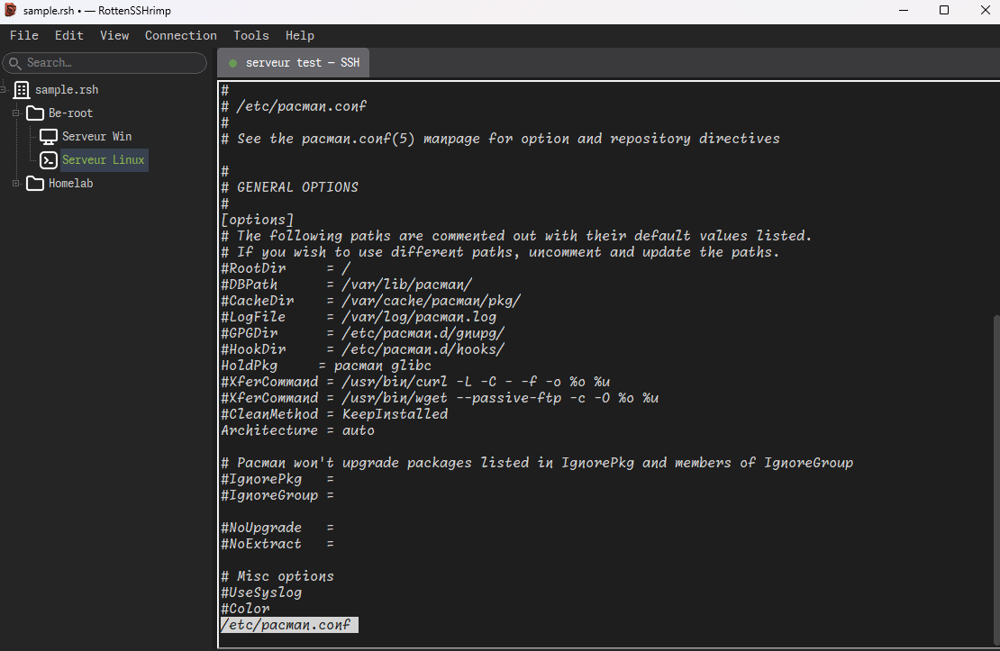
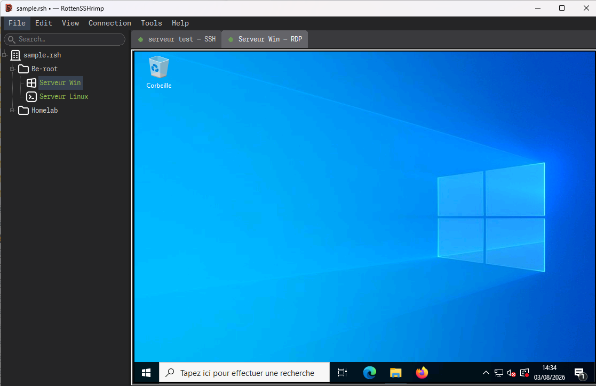

# RottenSSHrimp

> A rotten approach to remote administration.

A connection manager for SSH, RDP and VNC. Written in Free Pascal / Lazarus,
a stack whose obituary has been written several times and which keeps failing
to attend its own funeral. Runs on Windows, Linux and macOS.

One tree of machines, one tab per session, one encrypted file behind it all.
The load average in that screenshot is 0.12, which is the only time anybody
takes a screenshot.

## Why

The alternatives come in three families, and you have met all three.

There is the one that wants a subscription, an account, and a monthly reminder
that your infrastructure has quietly become somebody else's recurring revenue.
There is the one that ships three hundred megabytes of Chromium so that a
terminal can have rounded corners and a splash screen. And there is
`servers.txt`, open on your second monitor since 2019, which at least has the
decency not to pretend.

RottenSSHrimp is native code with a native widget set. It does not want your
email address. It has never heard of a workspace, a team plan, or a seat. It
will not sync your private keys to a cloud where they can be conveniently
available during somebody else's breach. It starts in under a second, and the
window it opens is the entire product: there is no second window where the good
features live behind a Pro badge.

Nothing leaves the machine except the sessions you asked for. No telemetry, no
crash reporting, no "help us improve", no update ping phoning home to mention
that you launched it at 3 a.m. again. This is not a feature to be proud of. It
is the floor. That it is worth writing down at all says more about whatever you
were using last week than about this.

The name is a warning label, not false modesty. Something in here will annoy
you. But it will annoy you locally, offline, for free, and forever.

## What it does

**Sessions.** SSH terminals with a real terminal emulator, RDP, and VNC, all in
tabs, all in one window. Broadcast mode fans one keyboard across N SSH sessions
at once, clusterssh style, because sometimes twelve machines need the same
mistake made on all of them simultaneously. There is a local shell tab too
(PowerShell or ConPTY on Windows, your login shell elsewhere) for when the
thing you need to run is on this side of the network.

Pick the hosts the way you pick files, Ctrl and Shift, up to sixteen, then
connect or broadcast to exactly that set. Folders are welcome in the selection
and expand to what they contain. The tree reflects how you filed things in
March; the incident has its own ideas about which six machines belong together
tonight.

Multi-Terminal is that same grid with the broadcast bar removed: every session
visible, one of them listening, Ctrl+Alt+arrows (Cmd+Option on macOS) to move
the focus around the tiles. For the far more common case where you need to
watch sixteen machines and type at precisely one of them.

**A tree that scales past forty hosts.** Folders, custom icons, search, and
per-folder credential inheritance. Plus a dashboard that answers "which of
these are actually up" before the meeting where you were going to claim they
all were.

**Ping.** Right-click a host, *Ping Host*, and get a tab that answers one
question without editorialising: is it coming back, and since when. Sent,
received, lost as a count and a percentage, round-trip min/avg/max/mdev, the
current run of consecutive losses, and a bar chart of the recent probes where
the gaps are the part you were looking for.

ICMP straight from the application, with no elevation, no root and no
capability to hand out, on all three platforms. It says *no reply*, never
*down*, because a great many entirely healthy machines have been silently
discarding ICMP since a hardening review in 2018 and it would be impolite to
accuse them of anything.

Mostly you will use it for the ninety seconds after a reboot you started
yourself, during which the honest option is to watch a graph, and the
alternative is to retry the connection every four seconds while calling it
diagnostics.

**Jump hosts.** Any SSH host in the tree can serve as a bastion for any other
connection, and that includes RDP and VNC, not just SSH. The session is
tunnelled through it, so the target only has to be reachable from the bastion,
never from you.

Ideal for the afternoon you have to repair the VPN concentrator that everyone,
yourself very much included, was connected through until eleven minutes ago.
Or the firewall whose new rule you tested thoroughly, from the wrong side. Or
the one remaining machine in that subnet still answering, which you are now
going to use as a raft.

**Credentials.** Passwords, private keys, agent auth, and managed keys the
application generates, rotates, and pushes with a built-in `ssh-copy-id`.
Private keys go to libssh2 in memory and never touch the disk in plaintext,
which is the absolute floor of decency and yet remains a differentiator.

**Security keys.** Or no private key at all: a FIDO2 token, a YubiKey for
instance, can hold it instead of the document. What is stored here is a
handle. The secret is generated on the token, never leaves it, and every
connection asks for a touch. Copy SSH ID and key rotation behave exactly as
they do for a software key, with one more finger involved.

Same token, same document, on any of the three operating systems. Windows goes
through Windows Hello, so the PIN prompt is the system's own and nothing asks
for administrator rights. Needs OpenSSH 8.2 or later on the server and
libfido2 on the client, which the packages bring along.

It covers the one case the rest of the model cannot. Somebody has your
document and your master password, from a backup, a stolen laptop, or ten
minutes at your desk during the meeting you were both in. What they get is an
excellent inventory of your infrastructure and no way whatsoever into the
hosts that authenticate with the token, which is in your pocket.

Which is also, of course, the failure mode. Days go rotten in ways no threat
model bothers to enumerate: the token goes through a wash cycle, stays behind
in a hotel room in Lyon, or lives in the front USB port of a machine that is
now four hundred kilometres away in a building you need a badge and an
appointment to enter. A key nobody can copy is a key *you* cannot copy either,
and the property you were so pleased about turns around and works against you
at exactly the same strength. Enrol a second token, or keep one credential
that still opens the door the old way, and do it on an afternoon when nothing
is broken. There will not be a convenient moment later.

**Containers and pods.** Docker and Podman containers, Kubernetes pods, opened
as terminal tabs like anything else. Because eventually the incident is inside
the cluster, and `kubectl exec` from memory at 2 a.m. has never once gone well.

**Imports.** Your `~/.ssh/config`, a CSV of hostnames, or a JSON export from
another instance. Export a subtree to hand a colleague exactly the six machines
they need, which is six more than most people are comfortable giving and about
forty fewer than the last person handed over by pasting the whole file into a
chat window.

## Getting it

Prebuilt packages for Windows, Linux and macOS are on the
[releases page](https://github.com/clamy54/RottenSSHrimp/releases). Download,
unpack, run.

- Windows: an installer, x64, native DLLs bundled. Not Authenticode signed, so
  SmartScreen will describe the publisher as unknown and hide *Run anyway*
  behind *More info*. It is not wrong about the publisher.
- Linux: a `.deb`, or a relocatable tarball with a privilege-free `install.sh`.
- macOS: a `.dmg`, arm64, ad-hoc signed, which is to say signed by nobody.
  Gatekeeper blocks the first launch and offers *Move to Trash* as the helpful
  default. Open it once, let it be refused, then *System Settings > Privacy &
  Security > Open Anyway*.

Two operating systems will therefore warn you that this software is not to be
trusted. Both are working exactly as designed, and neither is lying.

### Building from source

You need Lazarus 4.8 and FPC 3.2.2. The full procedure for all three platforms,
including the native dependencies and the two libraries that ship *with* the
application instead of coming from the system, is in
[`BUILD.md`](BUILD.md). Packaging scripts for the installer, the `.deb` and the
`.dmg` live in [`dist/`](dist/).

## Third parties

RottenSSHrimp links or loads work that is not ours: libsodium, libssh2, FreeRDP,
libvncclient, SQLite, OpenSSL, zlib, libjpeg-turbo, cJSON, the LCL and the FPC
runtime. It embeds the Monaspace fonts, a Nerd Fonts build of JetBrains Mono
NL, and two icon sets.

Every one of them is inventoried in
[`LICENSES/THIRD-PARTY-NOTICES.md`](LICENSES/THIRD-PARTY-NOTICES.md), with its
license, what we modified, and what a redistributor has to do about it. Two
entries there deserve reading rather than skimming: `libvncclient`, which is
GPL-2.0-**or-later** and whose corresponding source ships in
[`third_party/libvnc/`](third_party/libvnc/), and the Papirus icons, which are
GPL-3.

## License

GPL-3.0-or-later. See [`LICENSE`](LICENSE).

No warranty, as the license says at some length and in capital letters. If this
software eats your connection tree the night before an audit, you have the
source, you have the bug, and you have my sincere condolences, in that order.

(c) 2025-2026 Cyril LAMY.
