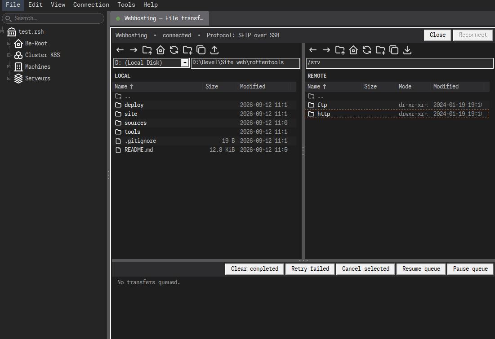

# RottenSSHrimp

> A rotten approach to remote administration.

A connection manager for SSH, RDP and VNC on Windows, Linux and macOS, written
in Free Pascal / Lazarus, a stack whose obituary has been written several
times and which keeps failing to attend its own funeral. The name is the only
rotten part. Underneath is the kind of paranoia you usually only find in
people who once restored production from a backup that turned out to be
empty.

The load average in that screenshot is 0.12, which is the only time anybody
takes a screenshot.

It also moves files, because sooner or later somebody wants the log, the dump,
or the certificate that expired on Friday and that nobody will admit to having
been in charge of. The traditional answer is a second program whose download
page has four green buttons, three of which install something you will spend
the afternoon removing. Here it is one more tab, already signed in, and it has
never once offered a toolbar, a browser or a free antivirus trial as the price
of copying a text file.

## Why

The alternatives come in three families: the one that wants a subscription
and quietly turns your infrastructure into somebody else's recurring revenue,
the one that ships three hundred megabytes of web browser so a terminal can
have rounded corners, and `servers.txt`, open on your second monitor since
2019, which at least has the decency not to pretend. RottenSSHrimp is a real
application that starts in under a second, does not want your email address,
and sends nothing anywhere except the connections you asked for: no tracking,
no "help us improve", no phoning home to report that you launched it at
3 a.m. again. Something in here will annoy you, but it will annoy you
locally, offline, for free, and forever.

## What it does

**One encrypted file.** Every machine, password and key lives in a single
file, locked with modern encryption and a master password that is slow to
guess on purpose. It is saved in a way that survives a power cut mid-save:
you get yesterday's version back, not a very secure pile of nothing. Lose the
file on a USB stick and whoever finds it can heat their office with graphics
cards for a few centuries and still read nothing.

**Sessions.** Terminals, remote desktops and a local shell, all as tabs in one
window. Open up to sixteen machines side by side and watch them all while
typing at one, or type into all of them at once, because sometimes twelve
machines need the same mistake made on all of them simultaneously. Every
server is recognised by its fingerprint, and one that suddenly looks
different stops you cold: "someone reinstalled it" and "someone is listening
in" look exactly alike until the second one reads your password.

**The tree.** Folders, icons, search, passwords shared by a whole folder, and a
dashboard that answers "which of these are actually up" before the meeting
where you were going to claim they all were.

**Ping.** A tab that answers one question: is it coming back, and since when.
No admin rights needed. It says *no reply*, never *down*, because half the
healthy machines on earth have been quietly ignoring ping since a security
review in 2018, and it would be rude to accuse them. Mostly you will use it
for the ninety seconds after a reboot you started yourself.

**Clipboard.** Copy and paste work in and out of remote desktops, files
included, both ways. Anything coming back from a server is
handled like a parcel that ticks: size-limited, opened in a private folder,
and never allowed to wander off to somewhere else on your disk. In terminals
the middle mouse button pastes, as Unix has insisted since before most of us
were born.

**Jump hosts.** Any server can serve as a stepping stone to the machines
hidden behind it, remote desktops included, with every step checked like the
first. Ideal for the afternoon you have to repair the VPN that everyone,
yourself very much included, was connected through until eleven minutes ago.

**SSH tunnels.** Reach the things only the server can see, through a tunnel
that opens with the terminal and dies with it. It answers to your machine
alone: a tunnel open to the whole network is a door into someone else's
network, propped open by you, and the incident report will spell your name
correctly.

**File transfer.** Two panels, your files on the left, the server's on the
right, the layout every file manager has used since 1986 because nobody has
improved on it without adding a cloud. A complete file is never replaced by
half of one: pull the cable mid-download and the old file is still there,
intact and faintly smug, and *Reconnect* picks up where it stopped. Shortcuts
are never followed, so one pointing at the whole disk stays a shortcut
instead of becoming the afternoon you copied everything, and when something
fails it says what, instead of *Completed*.

**Credentials.** Passwords and keys, including keys the application creates,
replaces, and installs on the server for you. Keys are never written to disk
unencrypted, which is the absolute floor of decency and yet remains a selling
point.

**Security keys.** A hardware key such as a YubiKey can hold your login
instead of the file, and asks for a touch at every connection. Whoever steals
your file and your master password gets an excellent inventory of your
infrastructure and no way in. Neither do you, once the key has been through a
wash cycle or stayed behind in a hotel room in Lyon: a key nobody can copy is
a key *you* cannot copy either. Set up a second one on an afternoon when
nothing is broken. There will not be a convenient moment later.

**Containers and pods.** Docker containers and Kubernetes pods open as
terminal tabs like anything else. Because eventually the incident is inside
the cluster, and typing the right command from memory at 2 a.m. has never once
gone well.

**Imports.** Bring your existing SSH configuration, a spreadsheet of
machines, or an export from another copy. Export a folder to hand a colleague
exactly the six machines they need, about forty fewer than the last person who
pasted everything into a chat window.

## Getting it

Packages for all three systems are on the
[releases page](https://github.com/clamy54/RottenSSHrimp/releases): an
installer for Windows, a `.deb` or a tarball for Linux, a `.dmg` for macOS,
all built automatically from this repository rather than on somebody's laptop
at 2 a.m. None is signed by anyone a corporation would vouch for, so Windows
and macOS will both warn you that this software is not to be trusted (*More
info > Run anyway* on Windows, *Privacy & Security > Open Anyway* on macOS).
Both are working exactly as designed, and neither is lying. To build it
yourself, see [`BUILD.md`](BUILD.md).

## Third parties

RottenSSHrimp stands on the shoulders of libsodium, libssh2, FreeRDP,
libvncclient, SQLite, OpenSSL, zlib, libjpeg-turbo, cJSON, Lazarus and Free
Pascal, plus a few fonts and icon sets, all listed with their licenses in
[`LICENSES/THIRD-PARTY-NOTICES.md`](LICENSES/THIRD-PARTY-NOTICES.md). Read,
rather than skim, the entries for `libvncclient` (GPL-2.0-**or-later**, source
in [`third_party/libvnc/`](third_party/libvnc/)) and the Papirus icons
(GPL-3).

## License

GPL-3.0-or-later, see [`LICENSE`](LICENSE). No warranty, as the license says at
some length and in capital letters. If this software eats your connection tree
the night before an audit, you have the source, you have the bug, and you have
my sincere condolences, in that order.

(c) 2025-2026 Cyril LAMY.
